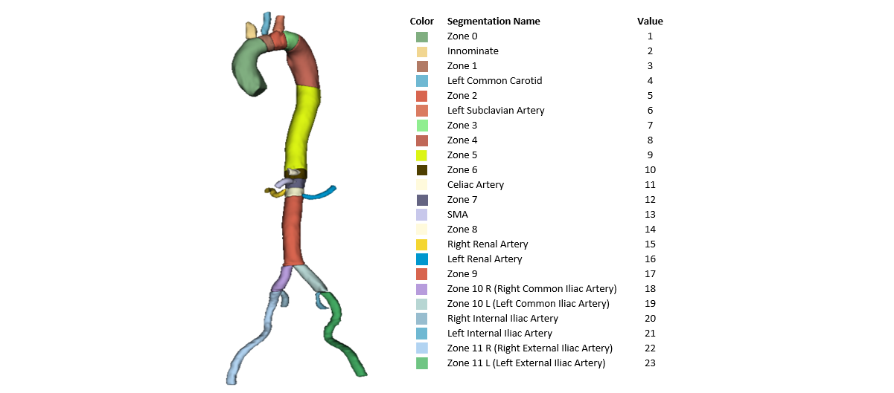

<h1>Multi-Class Segmentation of Aortic Branches and Zones in Computed Tomography Angiography</h1>

Welcome to the **AortaSeg24** challenge, where innovation meets collaboration in the pursuit of medical imaging excellence.

---

<h2>About the Challenge</h2>

This challenge focuses on proposing deep learning models for the segmentation of the Aorta, its branches, and zones. We provide an [example script](https://github.com/ImranNust/AortaSeg24_Duplicate/tree/main/training) utilizing [SwinUNETR](https://arxiv.org/abs/2201.01266) to guide you in developing your training script and training a module. Additionally, [sample validation code](https://github.com/ImranNust/AortaSeg24_Duplicate/tree/main/validation) is available to assess your proposed model's performance. Finally, a container submission script is offered to facilitate the submission process to the Grand Challenge. Feel free to modify this script to suit your specific needs.

---

<h2><u>
 Dataset Details 
</u></h2>

### Input Image Specifications
- **Type**: 3D CTA Volume
- **Axial Dimensions**: 
  - **Minimum**: $389\times389$ pixels
  - **Maximum**: $516\times516$ pixels
  - **Average**: $450\times450$ pixels
- **Voxel Resolution**: Isotropic, uniformly set to $\(1mm \times 1mm \times 1mm\)$.
- **Axial Slice Count**: 
  - **Range**: 578 to 801 slices
  - **Average**: 695 slices

### Output Segmentation Specifications
The output is a 3D segmentation model mirroring the input image characteristics, with the addition of 23 segmentation classes detailed below.

#### Segmentation Classes

### Accessing the Dataset

To access the dataset, please participate in the **[AortaSeg24 Challenge](https://aortaseg24.grand-challenge.org/)** hosted on the Grand Challenge platform. Begin by visiting the challenge page and proceed to complete the **[Data Agreement Form](https://aortaseg24.grand-challenge.org/dataset-access-information/)**. Upon submission and approval, you will gain full access to the dataset.

---

<h1>
<u><b>Citation</b></u>
</h1>

**If you find our code or data useful in your research, please cite our papers:**

1. @article{imran2024cis,
  title={CIS-UNet: Multi-Class Segmentation of the Aorta in Computed Tomography Angiography via Context-Aware Shifted Window Self-Attention},
  author={Imran, Muhammad and Krebs, Jonathan R and Gopu, Veera Rajasekhar Reddy and Fazzone, Brian and Sivaraman, Vishal Balaji and Kumar, Amarjeet and Viscardi, Chelsea and Heithaus, Robert Evans and Shickel, Benjamin and Zhou, Yuyin and others},
  journal={arXiv preprint arXiv:2401.13049},
  year={2024}
}

2. @article{krebs2024volumetric,
  title={Volumetric Analysis of Acute Uncomplicated Type B Aortic Dissection Using an Automated Deep Learning Aortic Zone Segmentation Model},
  author={Krebs, Jonathan R and Imran, Muhammad and Fazzone, Brian and Viscardi, Chelsea and Berwick, Benjamin and Stinson, Griffin and Heithaus, Evans and Upchurch Jr, Gilbert R and Shao, Wei and Cooper, Michol A},
  journal={medRxiv},
  pages={2024--03},
  year={2024},
  publisher={Cold Spring Harbor Laboratory Press}
}

2. @article{jiang2024microsegnet,
  title={MicroSegNet: a deep learning approach for prostate segmentation on micro-ultrasound images},
  author={Jiang, Hongxu and Imran, Muhammad and Muralidharan, Preethika and Patel, Anjali and Pensa, Jake and Liang, Muxuan and Benidir, Tarik and Grajo, Joseph R and Joseph, Jason P and Terry, Russell and others},
  journal={Computerized Medical Imaging and Graphics},
  volume={112},
  pages={102326},
  year={2024},
  publisher={Elsevier}
}

---
